<div align="center">

<br/>

# Vector

### From Vision to Victory.

**The fastest way to find your hackathon team.**

Browse hackathons — discover open teams — connect through requests and invitations — build together.

<br/>


<br/>

*The final project of **Tuwaiq Academy**'s Flutter & Dart Bootcamp.*

**[🌐 Try the web app](https://f-s-tuwaiq.github.io/Vector/)**  ·  **[🎬 Watch the demo](https://github.com/user-attachments/assets/862592c9-7e34-4c48-a99c-9f183468c67a)**  ·  **[📧 Email confirmation page](https://vector-email-confirmation.shammalbinni.chatgpt.site)**

</div>

<br/>

---

<details>
<summary><b>📑 Table of contents</b> — click to expand</summary>

<br/>

- [🎬 Demo](#demo)
- [📖 The Story](#story)
- [✨ Features](#features)
- [🎨 Design & Details](#design)
- [📱 Screenshots](#screenshots)
- [🛠️ Tech Stack](#tech-stack)
- [📂 Project Structure](#project-structure)
- [🚀 Running Vector](#running-vector) — including the Supabase setup
- [👥 Team](#team)

</details>

---

<a id="demo"></a>
## 🎬 Demo

<div align="center">

https://github.com/user-attachments/assets/862592c9-7e34-4c48-a99c-9f183468c67a

</div>

---

<a id="story"></a>
## 📖 The Story

We lived this problem ourselves. Every hackathon began the same way: capable people searching for a team, strong teams missing one essential skill, and valuable hours lost before the real work could even begin.

Vector was born from that frustration — built on a simple conviction: **if finding your team is the hardest part of a hackathon, it should become the easiest.**

The name carries the idea. In mathematics, a vector holds both magnitude and direction — what you bring, and where you're going. A team works the same way: individual strengths, pointed toward a shared purpose.

> **Vision** — every hackathon and every open team, in one place.
> **Victory** — walk in with your team already formed.

---

<a id="features"></a>
## ✨ Features

| | |
|---|---|
| **Guest Mode** | Explore the whole app before creating an account — browse hackathons, teams, and profiles as a guest |
| **Two-Step Signup** | Account essentials with LinkedIn (required) and GitHub (optional), then pick 1–6 skills across Design, Development, and Product |
| **Email Confirmation** | Signing up sends a confirmation link by email. It opens Vector's own branded website, which guides the user back to the app. One tap on **I've confirmed my email** and the app checks with Supabase that the email is really confirmed before saving the account and profile |
| **Hackathon Discovery** | Browse hackathons filtered by field — Security, AI, GovTech, Energy — with prizes, dates, and location at a glance |
| **Team Carousel** | Flip through every team in a hackathon, see open spots, current members, and the exact roles each team is missing |
| **Join Requests** | Send a request in one tap, then track it as Pending, Accepted, or Declined — and withdraw it anytime while pending |
| **Invitations** | Receive invites with the lead's personal message, a live expiry countdown, and one-tap accept or decline |
| **Team Builder** | Create your own team — name it, set its size (3–5), pick the roles you need or add your own, and become the team lead |
| **Team Management** | A leader view of your team with its members, a shortcut to the event's other teams, and the option to delete the team |
| **Skills & Evidence** | A profile built around what you bring — skills backed by uploaded certificates, your current teams, and previous participation |
| **Integrity by Design** | Uploaded certificates are hashed, eliminating duplicate files at the source |

<a id="design"></a>
## 🎨 Design & Details

Vector pays attention to the details that are usually skipped.
- **Instantly reactive** — the app reflects every action in real time: create a team and it appears immediately, accept an invitation and your status updates on the spot — no refresh, no waiting
- **Custom brand loader** — the "V" mark is drawn stroke-by-stroke as a custom animation, used at launch, login, and signup, with a smaller overlay version for long-running operations
- **No dead loading states** — lists load behind skeleton shimmer placeholders, and write actions show progress inside the button itself
- **Custom motion** — animated splash, a flip-style team carousel, and a hand-built bottom navigation bar
- **Consistent brand beyond the app** — email confirmation lives on its own standalone website that carries the same identity, colors, and typography as the app itself
- **Centralized design system** — zero inline colors in the codebase; every color, text style, and theme value comes from design tokens (`VectorColors`, `VectorText`, `VectorTheme`)
- **Security in the details** — accounts are saved only after the email is confirmed through a secure link, credentials stay out of the codebase via `.env`, and certificate uploads are hashed to block duplicates at the source

---

<a id="screenshots"></a>
## 📱 Screenshots

<div align="center">

### 🚀 Onboarding — Splash, Login & Sign Up

<table>
<tr>
<th align="center">Splash</th>
<th align="center">Log In</th>
<th align="center">Sign Up — Account</th>
<th align="center">Sign Up — Skills</th>
</tr>
<tr>
<td align="center"></td>
<td align="center"></td>
<td align="center">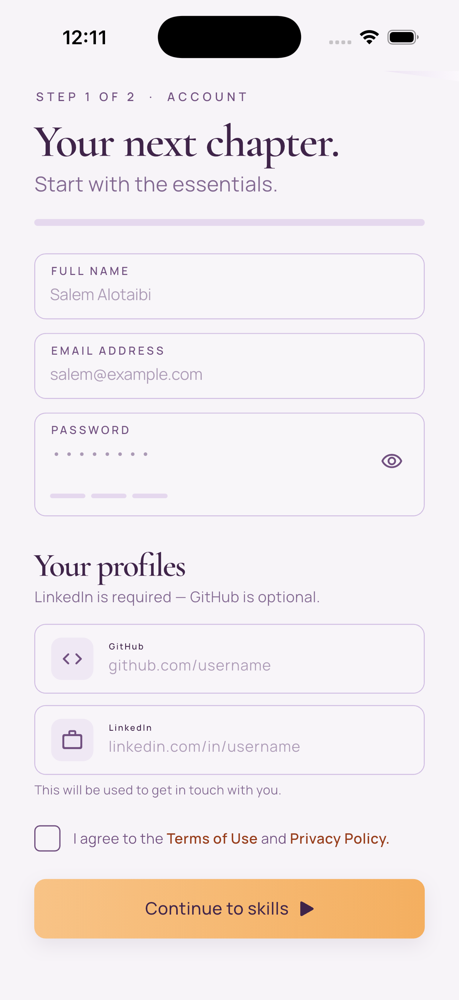</td>
<td align="center">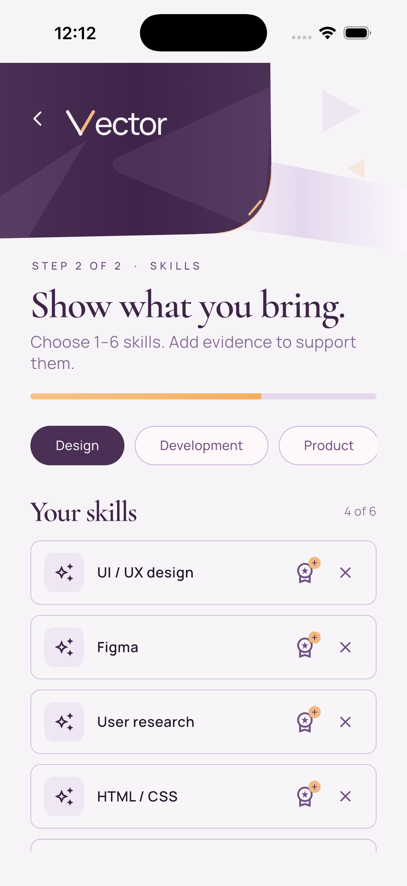</td>
</tr>
</table>

<table>
<tr>
<td align="center" valign="top">
<h3 align="center">📧 Email Confirmation</h3>
<table>
<tr>
<th align="center">Email Confirmation</th>
</tr>
<tr>
<td align="center">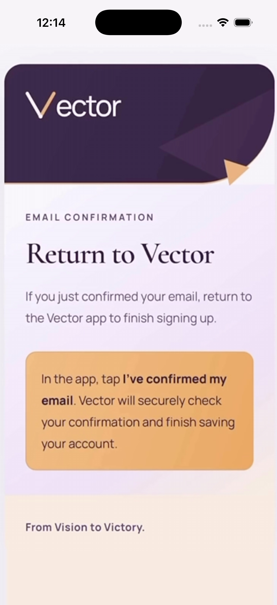</td>
</tr>
</table>
</td>
<td align="center" valign="top">
<h3 align="center">⏳ Brand Loader</h3>
<table>
<tr>
<th align="center">Loading Icon</th>
</tr>
<tr>
<td align="center">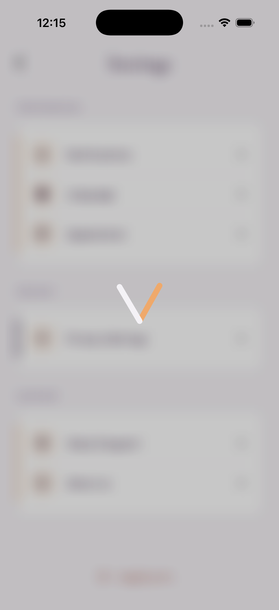</td>
</tr>
</table>
</td>
<td align="center" valign="top">
<h3 align="center">📎 Skill Evidence</h3>
<table>
<tr>
<th align="center">Certificate Upload</th>
</tr>
<tr>
<td align="center">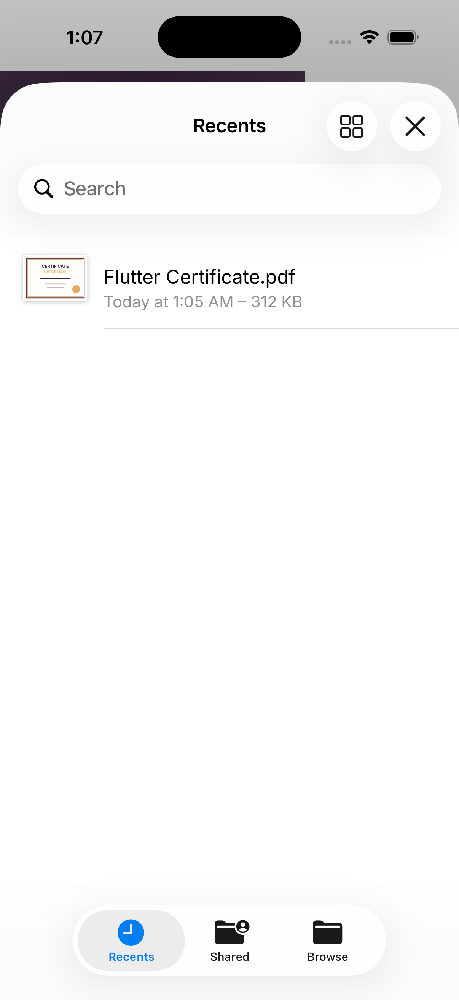</td>
</tr>
</table>
</td>
</tr>
</table>

### 🔍 Discovery & Joining — Hackathons, Teams & Requests

<table>
<tr>
<th align="center">Home — Hackathons</th>
<th align="center">Team Details</th>
<th align="center">Request Sent</th>
</tr>
<tr>
<td align="center"></td>
<td align="center">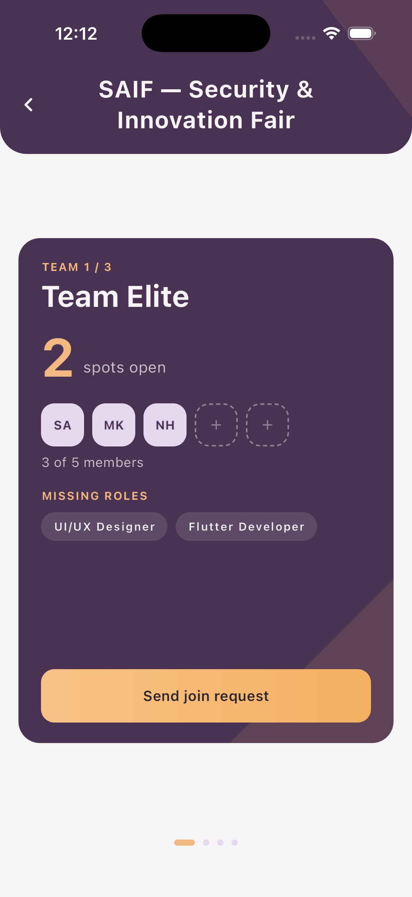</td>
<td align="center">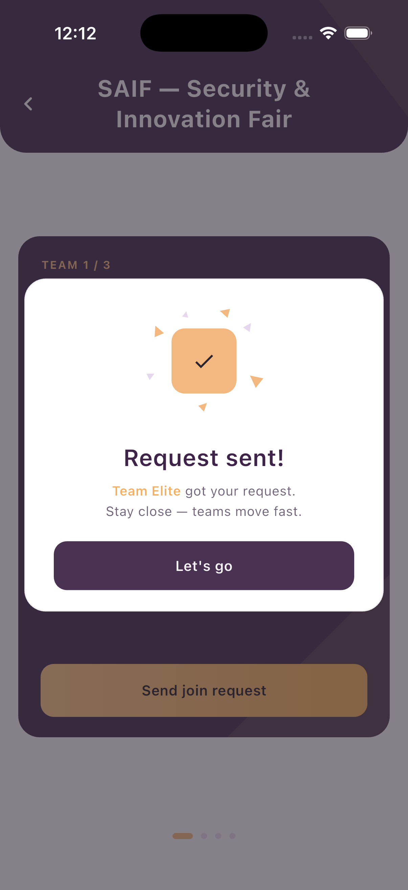</td>
</tr>
</table>

### 👥 Teams — Create & Manage Your Team

<table>
<tr>
<th align="center">Create a New Team</th>
<th align="center">Create Your Team</th>
<th align="center">My Team — Leader View</th>
</tr>
<tr>
<td align="center">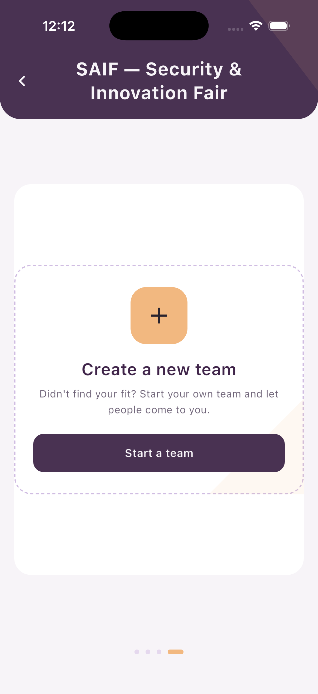</td>
<td align="center">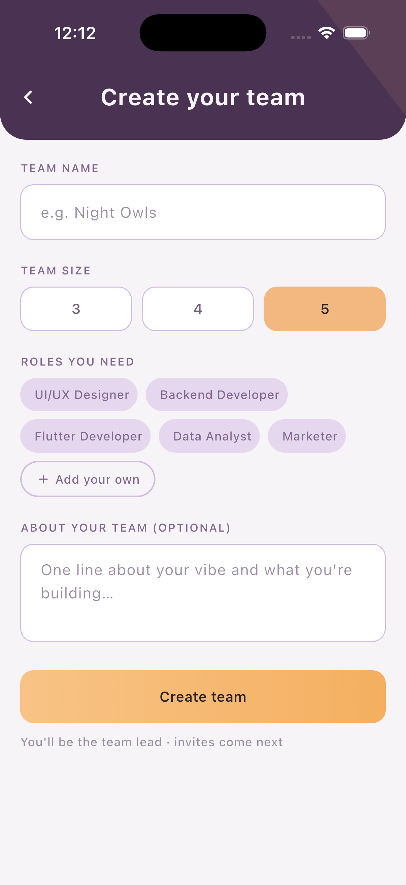</td>
<td align="center">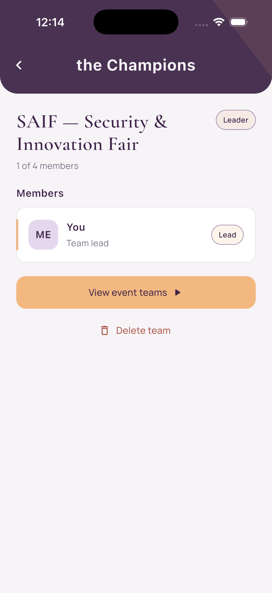</td>
</tr>
</table>

<table>
<tr>
<td align="center" valign="top">
<h3 align="center">✉️ Invites — Incoming & Sent</h3>
<table>
<tr>
<th align="center">Incoming</th>
<th align="center">Sent</th>
</tr>
<tr>
<td align="center">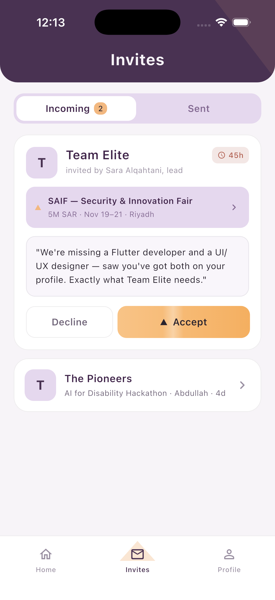</td>
<td align="center">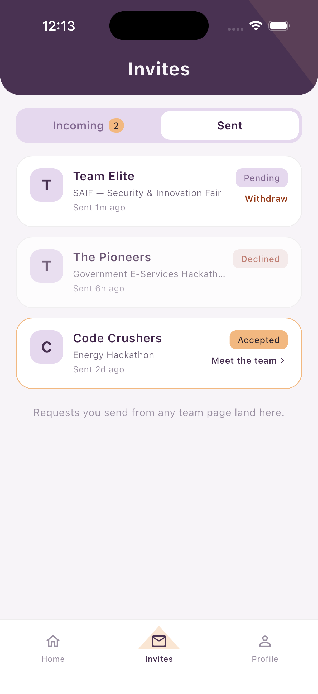</td>
</tr>
</table>
</td>
<td align="center" valign="top">
<h3 align="center">👤 Profile — Skills & Teams</h3>
<table>
<tr>
<th align="center">Profile</th>
<th align="center">Skills & Teams</th>
</tr>
<tr>
<td align="center"></td>
<td align="center">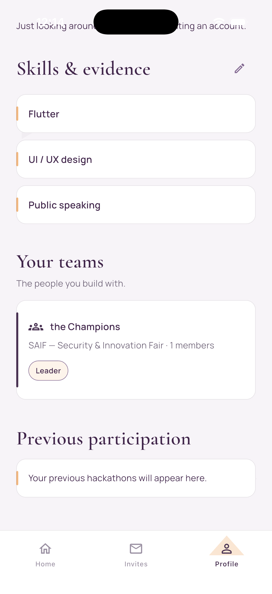</td>
</tr>
</table>
</td>
</tr>
</table>

### ⚙️ Settings & About

<table>
<tr>
<th align="center">Settings</th>
<th align="center">About Us</th>
</tr>
<tr>
<td align="center"></td>
<td align="center">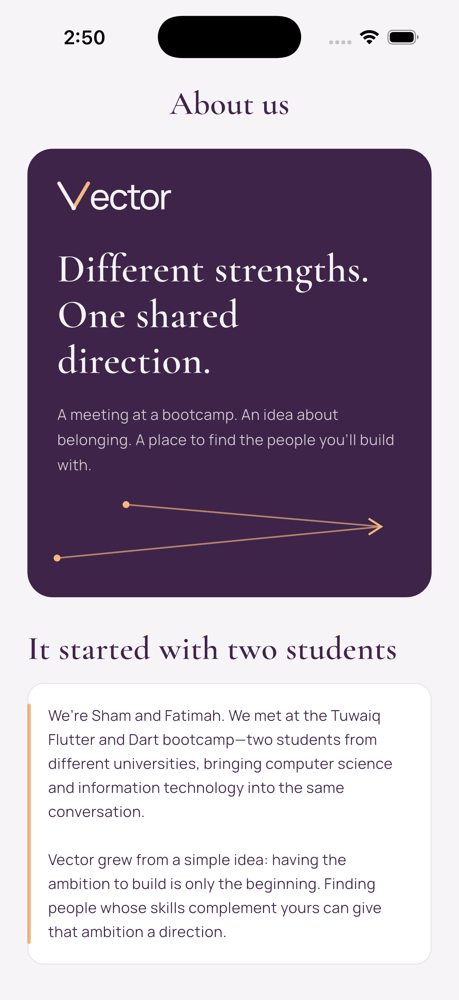</td>
</tr>
</table>

</div>

---

<a id="tech-stack"></a>
## 🛠️ Tech Stack

| Layer | Technology |
|---|---|
| Framework | Flutter / Dart (SDK ^3.13.1) — a single codebase for iOS, Android, and Web |
| Backend | Supabase — Postgres, Auth with email-link confirmation, and Storage, via `supabase_flutter` |
| Configuration | `flutter_dotenv` — credentials stay out of the codebase |
| Files | `file_selector` — certificate selection and upload |
| Typography | `google_fonts` |
| Integrity | `crypto` — file hashing to prevent duplicate uploads |

<a id="project-structure"></a>
## 📂 Project Structure

```
Vector/
├── lib/
│   ├── main.dart           # Entry point — initializes Supabase and launches the app
│   ├── screens/            # Splash, auth, home, teams, invites, profile, settings, create team, navigation shell
│   ├── data/               # Supabase-backed repositories with a graceful mock fallback
│   ├── models/             # Hackathon · Team · Member · Invitation · SentRequest
│   ├── services/           # Authentication, account creation, certificate upload, guest session
│   ├── widgets/            # Brand loader, skeleton loaders, cards, dialogs, shared UI
│   └── theme/              # Design tokens — VectorColors, VectorText, VectorTheme
├── auth-confirmation/      # The branded email-confirmation website users land on
├── vector-site/            # Project landing page
├── docs/                   # Email authentication and profile integration notes
├── test/                   # Widget and service tests (backend mocked)
├── tool/                   # build_web.py — validated production build for the web app
└── screenshots/            # Images used in this README
```

<a id="running-vector"></a>
## 🚀 Running Vector

Vector runs out of the box — no configuration needed. The app ships with a built-in mock data layer, so every screen and flow works immediately after `flutter pub get`.

To connect a live backend, add a `.env` file with your Supabase credentials. Authentication, live data, and storage activate automatically — no code changes required.

<details>
<summary><b>🔌 Connecting your own Supabase project</b> — click to expand</summary>

<br/>

**1. Credentials.** Create a Supabase project, copy `.env.example` to `.env`, and fill in the two public values:

```
SUPABASE_URL=https://<your-project>.supabase.co
SUPABASE_ANON_KEY=<your-anon-or-publishable-key>
```

Use only the public anon key — never the service-role key. On the web, this file is downloadable by anyone.

**2. Email confirmation.** In *Authentication*:
- Turn on **Confirm email**.
- Set the **Site URL** and add the same address to the **Redirect URLs** allow-list. Vector uses its confirmation website (source in `auth-confirmation/`), currently `https://vector-email-confirmation.shammalbinni.chatgpt.site`.
- Keep the default confirmation-link email. The user opens the link, returns to the app, and taps **I've confirmed my email**.

**3. Tables.** The app reads and writes these:

| Table | Holds |
|---|---|
| `hackathons` | Events shown on Home |
| `teams` | Teams for each hackathon, their size and missing roles |
| `join_requests` | Requests users send to teams |
| `invitations` | Invites teams send to users |
| `profiles` | Name, LinkedIn, and GitHub for each user |
| `user_skills` | The 1–6 skills each user picked |
| `skill_certificates` | Links a skill to its uploaded evidence file |

**4. Storage.** Create a private bucket named `certificates`. Evidence files are PDF, PNG, or JPG up to 10 MB, saved under their SHA-256 hash, and opened through 60-second signed URLs.

**5. Row Level Security.** Enable RLS and add policies so users can only change their own records (profile, skills, requests, evidence files). Storage policies decide who can open a file.

> The repository doesn't include a SQL schema yet, so table columns and policies are set up by hand. Until Supabase is configured, the app falls back to its built-in mock data.

</details>

---

<a id="team"></a>
## 👥 Team

<div align="center">

| | |
|:---:|:---:|
| **Sham Albinni** | **Fatimah Bin Mohammed** |
| Computer Science | Information Technology |

*Two students. Different universities. One shared direction.*

</div>

<br/>

<div align="center">

**Vector — From Vision to Victory.**

*Crafted with passion 🤍*

</div>
