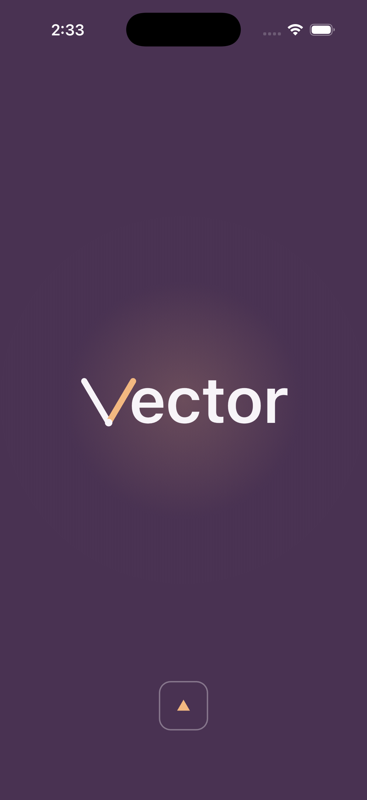
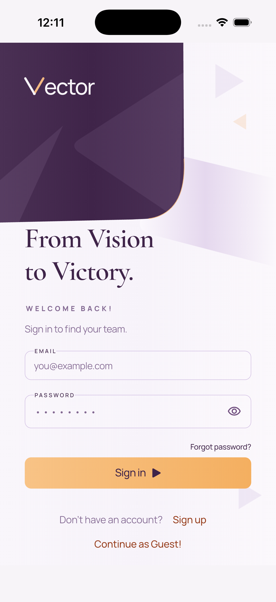
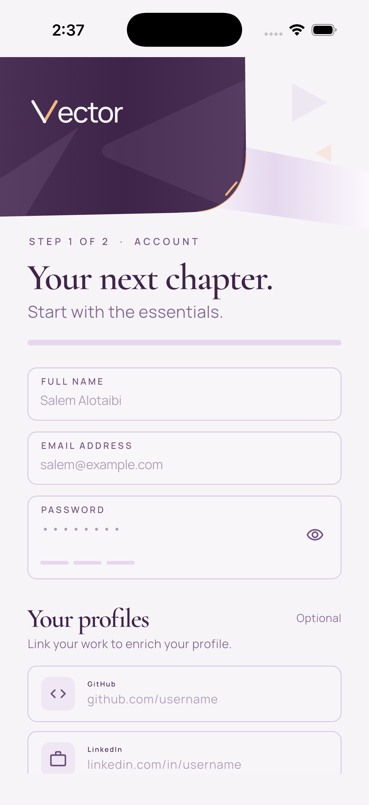
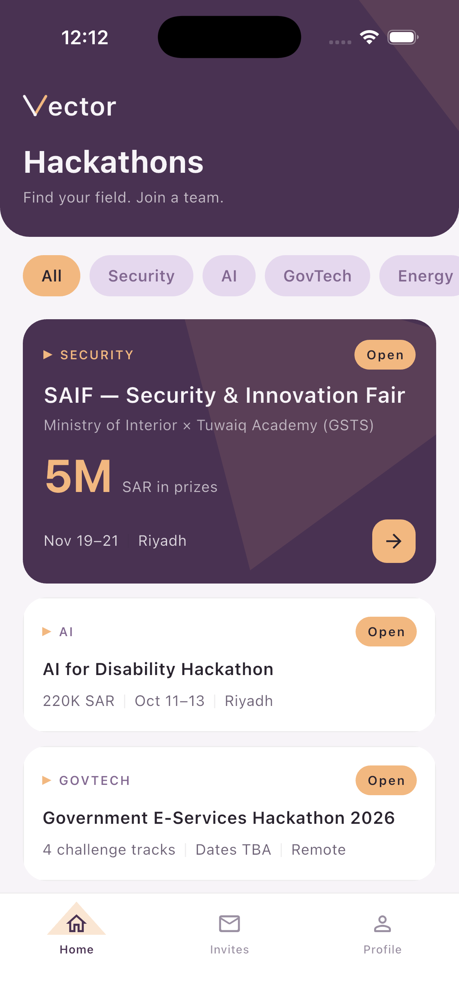
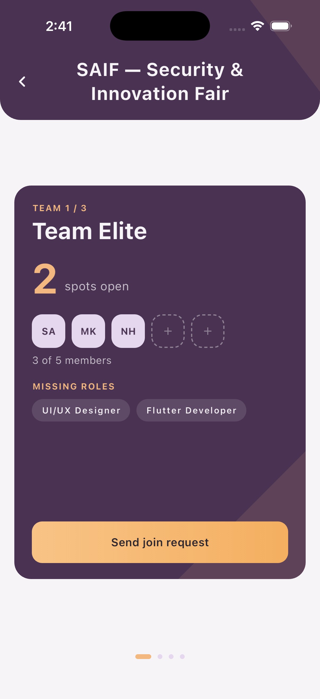
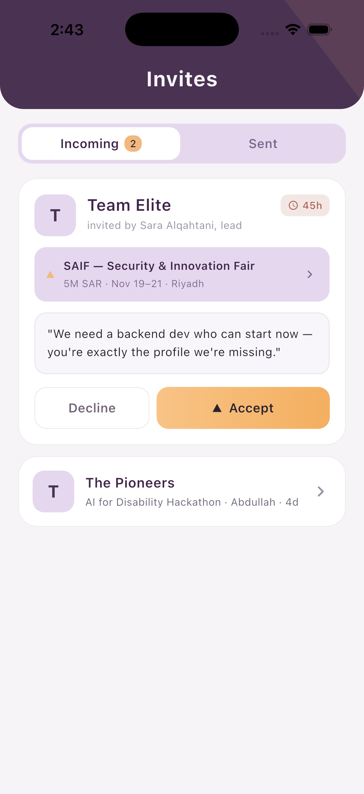
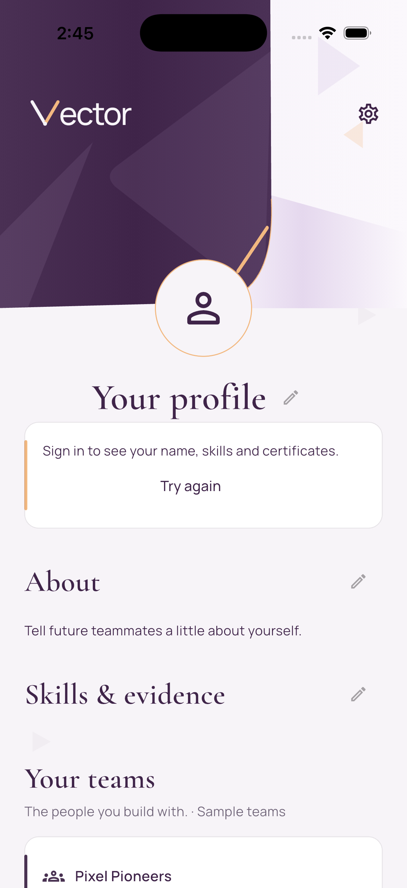
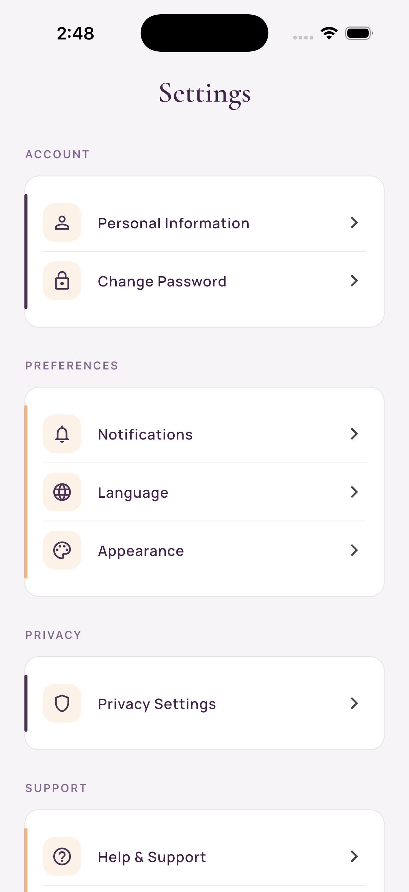

<div align="center">

<br/>

# Vector

### From Vision to Victory.

**The fastest way to find your hackathon team.**

Browse hackathons — discover open teams — connect through requests and invitations — build together.

<br/>


<br/>

*The final project of **Tuwaiq Academy**'s Flutter & Dart Bootcamp.*

</div>

<br/>

---

## 🎬 Demo

<div align="center">

<!-- Edit this file on GitHub and drag your demo .mp4 here — it embeds as a playable video automatically. -->

*Demo video coming soon.*

</div>

---

## 📖 The Story

We lived this problem ourselves. Every hackathon began the same way: capable people searching for a team, strong teams missing one essential skill, and valuable hours lost before the real work could even begin.

Vector was born from that frustration — built on a simple conviction: **if finding your team is the hardest part of a hackathon, it should become the easiest.**

The name carries the idea. In mathematics, a vector holds both magnitude and direction — what you bring, and where you're going. A team works the same way: individual strengths, pointed toward a shared purpose.

> **Vision** — every hackathon and every open team, in one place.
> **Victory** — walk in with your team already formed.

---

## ✨ Features

| | |
|---|---|
| **Hackathon Discovery** | Browse hackathons by field and explore every team competing in each one |
| **Join Requests** | Request to join teams that need your skills, and track the status of every request |
| **Invitations** | Receive, accept, decline, or withdraw team invitations in a single tap |
| **Team Builder** | Create your own team — set its size, define the roles you need, and let people come to you |
| **Verified Profiles** | Email-verified signup (OTP), a curated skills showcase, and certificate uploads stored securely |
| **Integrity by Design** | Uploaded certificates are hashed, eliminating duplicate files at the source |

## 🎨 The Experience

Vector is built to feel considered, not merely functional.

- **A signature brand loader** — a custom animated two-stroke "V" mark at launch, login, and signup, with a scaled-down overlay for heavier operations
- **Skeleton shimmer placeholders** while lists load, and in-button progress on every write action
- **An animated splash, a flip-style team carousel, and custom bottom navigation**
- **A strict design system** — no inline colors anywhere in the codebase; every value flows through centralized design tokens (`VectorColors`, `VectorText`, `VectorTheme`)

---

## 📱 Screenshots

<div align="center">

<table>
  <tr>
    <th align="center">Splash</th>
    <th align="center">Log In</th>
    <th align="center">Sign Up</th>
  </tr>
  <tr>
    <td align="center"></td>
    <td align="center"></td>
    <td align="center"></td>
  </tr>
  <tr>
    <th align="center">Home — Hackathons</th>
    <th align="center">Team Details</th>
    <th align="center">Invites</th>
  </tr>
  <tr>
    <td align="center"></td>
    <td align="center"></td>
    <td align="center"></td>
  </tr>
  <tr>
    <th align="center">Profile</th>
    <th align="center">Settings</th>
    <th align="center">About Us</th>
  </tr>
  <tr>
    <td align="center"></td>
    <td align="center"></td>
    <td align="center"></td>
  </tr>
</table>

</div>

---

## 🛠️ Tech Stack

| Layer | Technology |
|---|---|
| Framework | Flutter / Dart (SDK ^3.13.1) — a single codebase for iOS, Android, and Web |
| Backend | Supabase — Postgres, Auth with OTP email verification, and Storage, via `supabase_flutter` |
| Configuration | `flutter_dotenv` — credentials stay out of the codebase |
| Files | `file_selector` — certificate selection and upload |
| Typography | `google_fonts` |
| Integrity | `crypto` — file hashing to prevent duplicate uploads |

## 📂 Project Structure

```
lib/
├── main.dart       # Entry point — initializes Supabase and launches the app
├── screens/        # Splash, auth, home, teams, invites, profile, create team, navigation shell
├── data/           # Supabase-backed repositories with a graceful mock fallback
├── models/         # Hackathon · Team · Member · Invitation · SentRequest
├── services/       # Authentication, account creation, certificate upload, sign out
├── widgets/        # Brand loader, skeleton loaders, cards, dialogs, shared UI
└── theme/          # Design tokens — VectorColors, VectorText, VectorTheme
```

## 🚀 Getting Started

**1 — Clone the repository**

```bash
git clone https://github.com/F-S-Tuwaiq/Vector.git
cd Vector
```

**2 — Install dependencies**

```bash
flutter pub get
```

**3 — Configure Supabase**

Create a `.env` file in the project root:

```env
SUPABASE_URL=your_supabase_project_url
SUPABASE_ANON_KEY=your_supabase_anon_key
```

> The app runs fully without credentials — it falls back to mock data by design. Authentication and live data activate once real keys are provided.

**4 — Run**

```bash
flutter run
# or target a specific device
flutter run -d chrome
```

---

## 👥 Team

<div align="center">

| | |
|:---:|:---:|
| **Sham Albinni** | **Fatimah Bin Mohammed** |
| Computer Science | Information Technology |

*Two students. Different universities. One shared direction.*

</div>

<br/>

<div align="center">

**Vector — From Vision to Victory.**

*Crafted with passion in Saudi Arabia 🇸🇦 *

</div>
